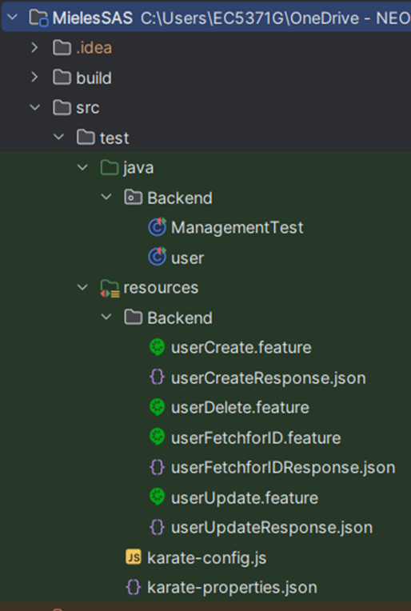
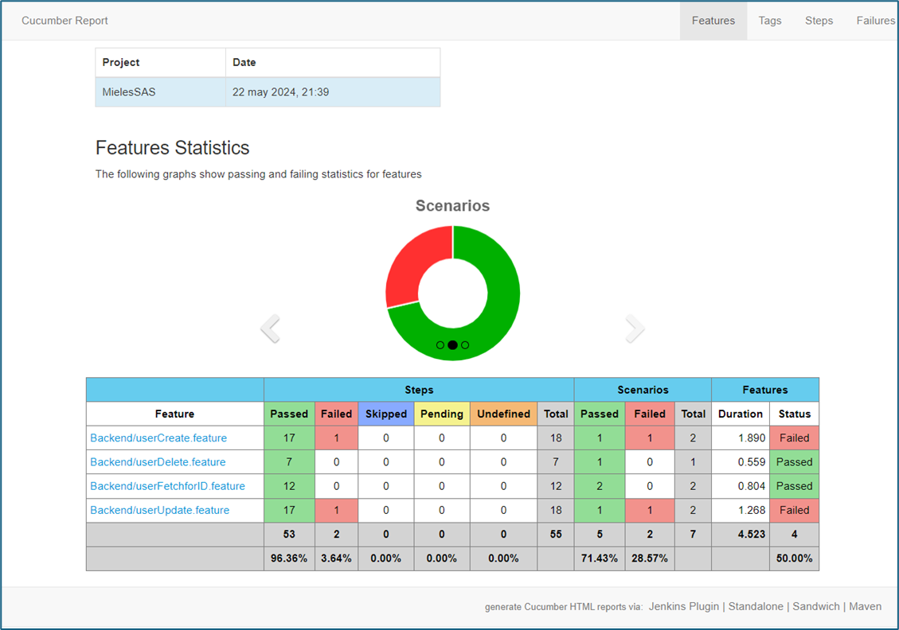

# backend_karate

## ​​💻​👨🏻‍💻​ **Introduction**

#### ​​​🧾​**Project Name:** 
QA AUTOMATION Backend

#### ​​​📑​**Project Purpose:** 

Automate testing of Mieles SAS REST APIs (https://reqres.in/) to ensure their functionality.

#### ​​​​🧰​**Technologies and Tools:**

* Test Framework: Karate
* Programming Language: Java
* Dependency Manager: Maven

#### 📒​**Project Scope:** 

Automates HTTP POST, GET, PUT, and DELETE methods of Mieles SAS REST APIs.

## ✅​**Prerequisites:**

* Java 21.0.2
* Maven 3.9.6
* IntelliJ IDEA (Optional but recommended)

## 👉🏻​**Installation Steps:**

The following steps describe how to install the repository.

1. Clone the repository: git clone https://github.com/JhonnyOrtega0107/backend_karate.git
2. Navigate to the project directory: cd backend_karate
3. Compile the project: mvn install
4. Open project in IntelliJ IDEA

   1. Open IntelliJ IDEA. 
   2. Select "Open Project". 
   3. Navigate to the cloned project directory and select it. 
   4. Click "Open".

## ​📚​**Project Structure:** 

The automation project has the following structure:

## ​​💻​**Test Results Summary:**

Once the tests have been executed, Karate generates a report in HTML format. This report can be found in the following path:

To view the report, you can open the file karate-summary.html in the browser and you are done.

### ​​   📋​**Total Scenarios:** 7
   
###    ​​   ✔️​**Passed Scenarios:** 5
   
###      ❌**Failed Scenarios:** 2

## ​​​📊​**Detailed Results:**

For detailed information on the test results, please refer to the file "2. Test Cases - API Automation" in the Documentation branch. This file contains a breakdown of each scenario, including its status, steps, and any associated errors or failures.

